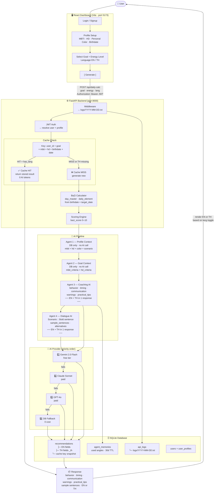

# Boong — Application Architecture



---

## Data Flow Summary

| Step | Where | What happens |
|------|--------|-------------|
| 1 | Frontend | User selects goal + energy + lang → POST /api/daily-calc |
| 2 | Middleware | Log URL + request + response + ms → .txt file |
| 3 | Auth | Validate JWT → load user profile |
| 4 | Cache | Check DB by (user + goal + mbti + hd + birthdate + date) |
| 4a | Cache HIT | Return stored EN or TH immediately — **0 AI tokens** |
| 4b | Cache MISS | Continue to pipeline |
| 5 | BaZi | Compute day_master + daily_element from birthdate |
| 6 | Scoring | Calculate bazi_score 0–10 |
| 7 | Agent 1 | Build profile context from DB (no AI) |
| 8 | Agent 2 | Build goal context from DB (no AI) |
| 9 | Agent 3 | AI call → coaching output **EN + TH** in 1 response |
| 10 | Agent 4 | AI call → sentences in `Scenario :: Bold sentence` format **EN + TH** |
| 11 | AI Priority | Gemini → Claude Sonnet → GPT-4o → DB Fallback |
| 12 | DB | Save EN + TH + cache key to recommendations table |
| 13 | Frontend | Render requested language, show EN/TH toggle |

---

## Database Tables

```
recommendations          ← coaching outputs + cache
  ├─ profile_mbti        ← cache key
  ├─ profile_hd_type     ← cache key
  ├─ profile_birthdate   ← cache key
  ├─ behavior_recommendation     + behavior_recommendation_th
  ├─ timing_guidance             + timing_guidance_th
  ├─ communication_strategy      + communication_strategy_th
  ├─ warnings                    + warnings_th
  ├─ practical_tips              + practical_tips_th
  ├─ sample_sentences            + sample_sentences_th
  ├─ alternative_responses       + alternative_responses_th
  └─ coaching_summary            + coaching_summary_th

api_logs                 ← every HTTP request
  ├─ method, url, status_code
  ├─ request_body, response_body (4KB cap)
  └─ duration_ms, created_at

agent_memories           ← prevents repeated coaching angles
  └─ expires after 30 days

users                    ← auth
user_profiles            ← MBTI · HD · Personal Color · birthdate
```

---

## Token Cost Model

| Scenario | AI Calls | Cost |
|----------|----------|------|
| First request (new day) | 2 calls (Agent 3 + 4) | ~$0.01 |
| Same goal, same day | 0 calls — cache hit | **$0.00** |
| Switch EN → TH | 0 calls — already in DB | **$0.00** |
| New goal, same day | 2 calls | ~$0.01 |
